# SQL Coding Exercises – EventManagement Database

This folder contains **25 SQL coding exercises** along with the schema setup script (`tables.sql`) for an **Event Management System** database.

---

## 📂 Directory Structure

```text
SQL/
├── tables.sql                  # Database creation, schema DDL & sample data insert script
├── ex_no_1.sql                 # Exercise 1: Select queries & filtering
├── ex_no_2.sql to ex_no_24.sql  # Exercises 2 to 24: Joins, Aggregations, Subqueries
├── ex_no_25.sql                # Exercise 25: Complex analytical & group queries
└── README.md                   # SQL Exercises documentation
```

---

## 🗄️ Database Schema (`EventManagement`)

The exercises operate on the `EventManagement` database schema defined in [`tables.sql`](file:///e:/Placement/CTS/Upskilling_coding_exercises/SQL/tables.sql):

```mermaid
erDiagram
    Users ||--o{ Events : organizes
    Users ||--o{ Registrations : makes
    Users ||--o{ Feedback : submits
    Events ||--o{ Sessions : contains
    Events ||--o{ Registrations : includes
    Events ||--o{ Feedback : receives
    Events ||--o{ Resources : holds

    Users {
        int user_id PK
        string full_name
        string email
        string city
        date registration_date
    }
    Events {
        int event_id PK
        string title
        string description
        string city
        datetime start_date
        datetime end_date
        enum status
        int organizer_id FK
    }
    Sessions {
        int session_id PK
        int event_id FK
        string title
        string speaker_name
        datetime start_time
        datetime end_time
    }
    Registrations {
        int registration_id PK
        int user_id FK
        int event_id FK
        date registration_date
    }
    Feedback {
        int feedback_id PK
        int user_id FK
        int event_id FK
        int rating
        string comments
        date feedback_date
    }
    Resources {
        int resource_id PK
        int event_id FK
        enum resource_type
        string resource_url
        datetime uploaded_at
    }
```



---

## 📑 Exercise Topic Index (1 – 25)

| File Name | Primary SQL Topic | Operations / Concepts Used |
|---|---|---|
| [ex_no_1.sql](file:///e:/Placement/CTS/Upskilling_coding_exercises/SQL/ex_no_1.sql) | Data Selection | `SELECT`, `WHERE` filtering on Users and Events. |
| [ex_no_2.sql](file:///e:/Placement/CTS/Upskilling_coding_exercises/SQL/ex_no_2.sql) | Sorting & Ordering | `ORDER BY` start date and registration date. |
| [ex_no_3.sql](file:///e:/Placement/CTS/Upskilling_coding_exercises/SQL/ex_no_3.sql) | Pattern Matching | `LIKE`, `%` wildcard string searches. |
| [ex_no_4.sql](file:///e:/Placement/CTS/Upskilling_coding_exercises/SQL/ex_no_4.sql) | Aggregation Functions | `COUNT()`, `AVG()` rating calculations. |
| [ex_no_5.sql](file:///e:/Placement/CTS/Upskilling_coding_exercises/SQL/ex_no_5.sql) | Grouping Data | `GROUP BY` event ID, user city. |
| [ex_no_6.sql](file:///e:/Placement/CTS/Upskilling_coding_exercises/SQL/ex_no_6.sql) | Group Filtering | `HAVING` clause filtering aggregated counts. |
| [ex_no_7.sql](file:///e:/Placement/CTS/Upskilling_coding_exercises/SQL/ex_no_7.sql) | Inner Joins | `INNER JOIN` Users with Registrations and Events. |
| [ex_no_8.sql](file:///e:/Placement/CTS/Upskilling_coding_exercises/SQL/ex_no_8.sql) | Left Outer Joins | `LEFT JOIN` Events with Resources and Feedback. |
| [ex_no_9.sql](file:///e:/Placement/CTS/Upskilling_coding_exercises/SQL/ex_no_9.sql) | Multi-table Joins | Joining Users, Registrations, Events, and Sessions. |
| [ex_no_10.sql](file:///e:/Placement/CTS/Upskilling_coding_exercises/SQL/ex_no_10.sql) to [ex_no_15.sql](file:///e:/Placement/CTS/Upskilling_coding_exercises/SQL/ex_no_15.sql) | Subqueries & Nested Queries | `IN`, `EXISTS`, Scalar subqueries for event statistics. |
| [ex_no_16.sql](file:///e:/Placement/CTS/Upskilling_coding_exercises/SQL/ex_no_16.sql) to [ex_no_20.sql](file:///e:/Placement/CTS/Upskilling_coding_exercises/SQL/ex_no_20.sql) | Date & Time Functions | `DATEDIFF`, `DATE_FORMAT`, `NOW()` datetime manipulation. |
| [ex_no_21.sql](file:///e:/Placement/CTS/Upskilling_coding_exercises/SQL/ex_no_21.sql) to [ex_no_25.sql](file:///e:/Placement/CTS/Upskilling_coding_exercises/SQL/ex_no_25.sql) | Complex Analytics | Multi-level aggregation, CTEs / Window functions, Null handling. |

---

## ⚡ How to Setup & Run

1. Connect to MySQL / MariaDB Server.
2. Execute [`tables.sql`](file:///e:/Placement/CTS/Upskilling_coding_exercises/SQL/tables.sql) to initialize the database:
   ```sql
   SOURCE e:/Placement/CTS/Upskilling_coding_exercises/SQL/tables.sql;
   ```
3. Run any exercise script:
   ```sql
   SOURCE e:/Placement/CTS/Upskilling_coding_exercises/SQL/ex_no_1.sql;
   ```
